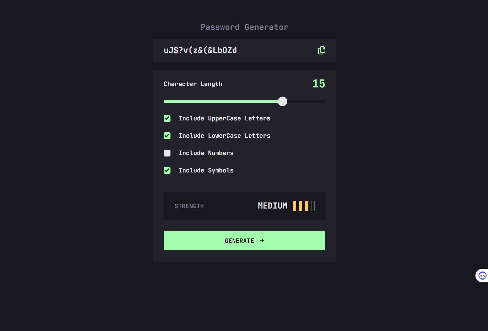

# Password generator app 

Users should be able to:

- Generate a password based on the selected inclusion options
- Copy the generated password to the computer's clipboard
- See a strength rating for their generated password
- View the optimal layout for the interface depending on their device's screen size
- See hover and focus states for all interactive elements on the page

### Screenshot

### Links

- Solution URL: [solution URL ](https://github.com/DavidIrvine-TW/password-generator-app)
- Live Site URL: [live site](https://davidirvine-tw.github.io/password-generator-app/)

### Built with

- Semantic HTML5 markup
- CSS custom properties
- Flexbox
- CSS Grid
- Mobile-first workflow
- [React](https://reactjs.org/) - JS library
- [Radix-ui](https://www.radix-ui.com/) 
- [Tailwindcss](https://tailwindcss.com/)

## Author

- Website - [DavidIrvine-TW](https://github.com/DavidIrvine-TW)
- Frontend Mentor - [DavidIrvine-TW](https://www.frontendmentor.io/profile/DavidIrvine-TW)

